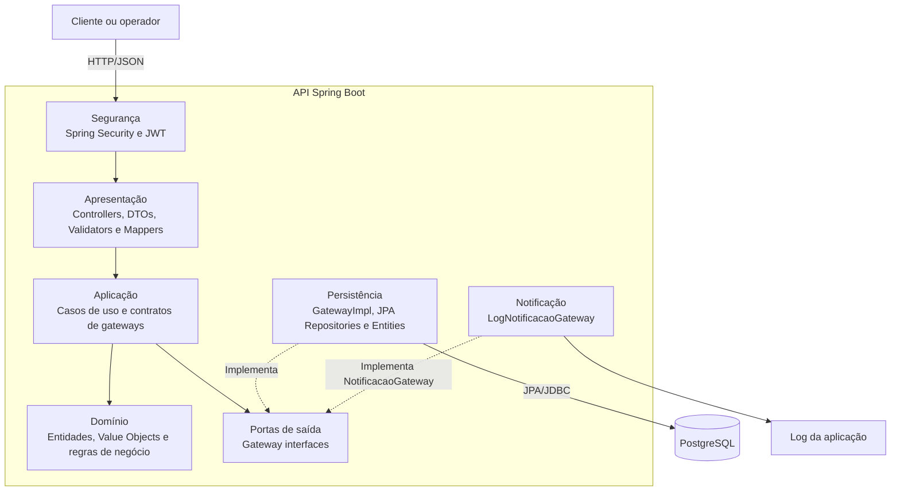
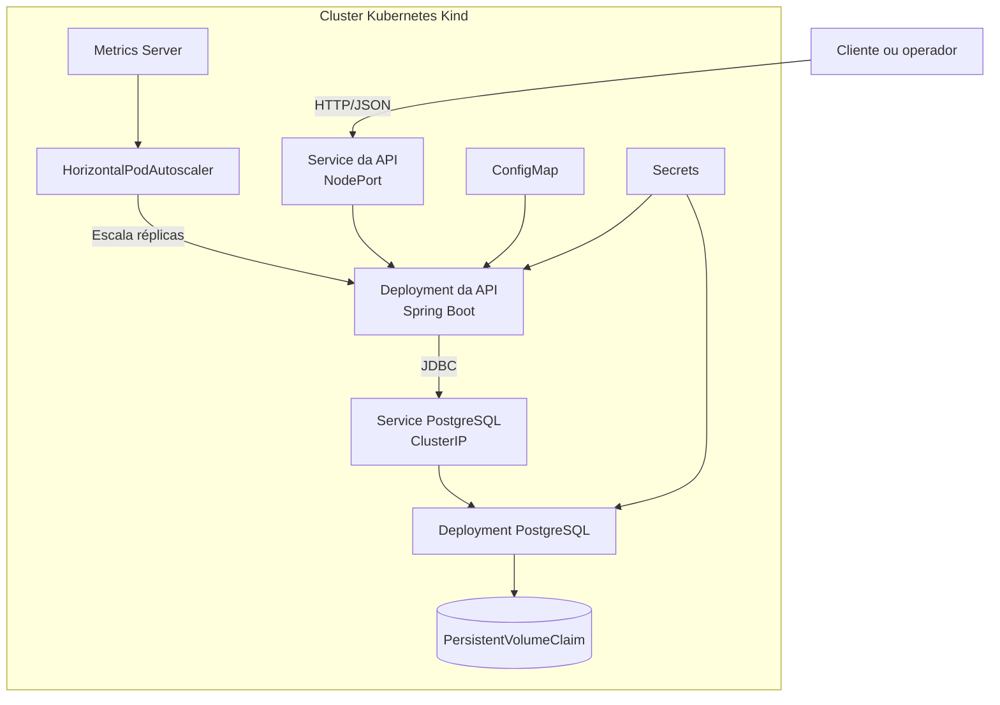

# Sistema de Oficina Mecânica – Tech Challenge Fase 2

## Descrição da solução e objetivos da fase

API backend para gestão de ordens de serviço de uma oficina mecânica.

O projeto evolui a entrega da Fase 1 com melhor separação de camadas, regras de domínio mais explícitas, testes automatizados, autenticação JWT, Docker, Kubernetes, Terraform e pipeline de integração contínua com GitHub Actions.

A aplicação permite controlar o ciclo de vida de uma ordem de serviço, desde a abertura com cliente, veículo, serviços e peças, até aprovação de orçamento, alteração de status, baixa de estoque e acompanhamento público pelo cliente.

Nesta fase, o objetivo é disponibilizar a solução de forma reproduzível e observável, com infraestrutura como código, execução conteinerizada, orquestração em Kubernetes, persistência de dados, escalabilidade horizontal e um fluxo automatizado de testes e deploy.

## Funcionalidades

- Gestão de clientes.
- Gestão de veículos.
- Gestão de serviços.
- Gestão de peças.
- Gestão de estoque com entrada e saída.
- Abertura de ordem de serviço.
- Associação de cliente, veículo, serviços e peças à ordem de serviço.
- Orçamento automático com cálculo do valor total.
- Aprovação e recusa de orçamento.
- Controle de status da ordem de serviço.
- Listagem de ordens de serviço em andamento, priorizada por status e por antiguidade.
- Acompanhamento público da ordem de serviço.
- Notificação simulada por log ao alterar o status da OS.
- Autenticação JWT para rotas administrativas.
- Documentação Swagger/OpenAPI.

## Tecnologias

- Java 21
- Spring Boot
- Spring Security
- Spring Data JPA
- PostgreSQL
- H2 para testes
- Maven
- Docker
- Docker Compose
- Kubernetes
- Terraform
- GitHub Actions
- JWT
- Swagger/OpenAPI
- JaCoCo
- Spring Boot Actuator

## Arquitetura proposta

O projeto segue uma separação em camadas inspirada em Clean Architecture, mantendo as regras de negócio desacopladas de detalhes externos como banco de dados, segurança, controllers e frameworks.

### Componentes da aplicação

Principais camadas:

- `domain`: entidades e regras de negócio.
- `application`: casos de uso e contratos de gateways.
- `infrastructure`: persistência, segurança, configurações e integrações externas.
- `controller`: entrada HTTP da aplicação.
- `mapper`: conversão entre entidades, DTOs e modelos de persistência.

Essa organização facilita manutenção, testes e evolução da aplicação, pois a regra de negócio não depende diretamente de detalhes de infraestrutura.



### Infraestrutura provisionada



O Terraform cria o cluster Kind e provisiona os recursos da aplicação. O PostgreSQL utiliza volume persistente, enquanto `ConfigMap` e `Secrets` fornecem as configurações necessárias aos containers.

### Fluxo de deploy

```mermaid
flowchart LR
    DEV["Desenvolvedor"] -->|"Push"| GITHUB["Repositório GitHub"]
    GITHUB --> ACTIONS["GitHub Actions"]
    ACTIONS --> TESTS["Testes e JaCoCo"]
    TESTS --> IMAGE["Build da imagem Docker"]
    IMAGE --> TERRAFORM["Terraform cria o cluster Kind"]
    TERRAFORM --> LOAD["Imagem carregada no cluster"]
    LOAD --> DEPLOY["Deploy da API e PostgreSQL"]
    DEPLOY --> HEALTH["Validação do Actuator Health"]
    HEALTH --> CLEANUP["Diagnóstico e destruição do ambiente de CI"]
```



## Segurança

As APIs administrativas são protegidas por autenticação JWT.

Para obter um token, execute:

```http
POST /auth/login
Content-Type: application/json
```

```json
{
  "username": "admin",
  "password": "123"
}
```

O corpo da resposta contém o JWT, válido por uma hora. No Swagger, clique em **Authorize** e informe somente o token retornado, sem escrever o prefixo `Bearer`. O Swagger adiciona esse prefixo automaticamente. Em clientes HTTP, envie o cabeçalho completo:

```http
Authorization: Bearer <token>
```

Um `403 Forbidden` nos endpoints protegidos indica que o token não foi enviado, está inválido ou expirou. Nesse caso, faça o login novamente e atualize o token no Swagger. Todas as rotas de ordem de serviço, inclusive `POST /ordens-servico`, usam a mesma regra de autenticação.

A rota de acompanhamento da ordem de serviço é pública, permitindo que o cliente consulte o andamento da OS sem precisar de autenticação:

```http
GET /ordens-servico/acompanhamento/{id}
```

Os callbacks externos usados pelo cliente ou por uma ferramenta de integração para aprovar ou recusar um orçamento também são públicos:

```http
POST /ordens-servico/{id}/aprovar-orcamento
POST /ordens-servico/{id}/negar-orcamento
```

As demais rotas de ordem de serviço continuam exigindo o JWT administrativo.

Também foram liberadas as rotas necessárias para documentação e health check:

```http
GET /swagger-ui/index.html
GET /v3/api-docs
GET /actuator/health
```

## Inativação lógica

Clientes, operadores, veículos, peças e serviços são inativados logicamente. O registro permanece no banco com `ativo=false` e deixa de aparecer nas consultas de itens ativos.

```http
PATCH /clientes/documento/{cpfCnpj}/inativar
PATCH /operadores/matricula/{matricula}/inativar
PATCH /veiculos/{id}/inativar
PATCH /pecas/{id}/inativar
PATCH /servicos/{id}/inativar
```

Não há exclusão física nesses endpoints.

## Abertura completa da OS

O endpoint de criação da ordem de serviço permite informar cliente, veículo, serviços e peças no mesmo payload:

```http
POST /ordens-servico
Authorization: Bearer <token>
Content-Type: application/json
```

Exemplo:

```json
{
  "cpfCnpj": "52998224725",
  "placa": "ABC1D23",
  "servicos": [
    {
      "servicoId": "60000000-0000-0000-0000-000000000001"
    }
  ],
  "pecas": [
    {
      "pecaId": "40000000-0000-0000-0000-000000000001",
      "quantidade": 2
    }
  ]
}
```

Durante a abertura da OS, a aplicação valida os cadastros, associa os serviços e peças, calcula o valor total e realiza a baixa de estoque em uma transação.

## Notificação de alteração de status

Conforme solicitado no enunciado, o sistema possui um mecanismo de notificação quando ocorre alteração no status da ordem de serviço.

Nesta entrega, o envio real de e-mail não foi implementado. Em vez disso, foi criada uma abstração na camada de aplicação e uma implementação em infraestrutura que simula o envio através de log.

O log é utilizado como mecanismo demonstrável da fase 2 e mantém a arquitetura preparada para uma futura integração com Gmail, SMTP, Amazon SES, SendGrid ou outro provedor, sem acoplar a regra de negócio a uma ferramenta externa.

### Como a notificação funciona

O fluxo ocorre de forma síncrona depois que uma transição de status é concluída com sucesso:

1. Um endpoint de transição de status chama o caso de uso correspondente.
2. O caso de uso valida a transição e persiste a ordem de serviço atualizada.
3. `NotificarAlteracaoStatusOrdemUseCase` monta a mensagem com o identificador e o novo status da OS.
4. A porta `NotificacaoGateway`, definida na camada de aplicação, é acionada.
5. `LogNotificacaoGateway`, na camada de infraestrutura, registra a simulação no nível `INFO` usando SLF4J.

A notificação é gerada nas transições `iniciar-diagnostico`, `aguardar-aprovacao`, `aprovar-orcamento`, `negar-orcamento`, `finalizar` e `entregar`. Se a ordem não existir ou a transição for inválida, o caso de uso encerra com erro e não registra uma notificação de sucesso.

### Como visualizar e demonstrar

Com a aplicação iniciada pelo Docker Compose, acompanhe os logs em outro terminal:

```bash
docker compose logs -f api
```

Depois, autentique-se, obtenha o ID de uma OS e execute no Swagger uma transição compatível com seu status atual, por exemplo:

```http
POST /ordens-servico/{id}/iniciar-diagnostico
Authorization: Bearer <token>
```

Para filtrar somente as notificações no PowerShell:

```powershell
docker compose logs -f api | Select-String "Simulando envio de e-mail"
```

No Kubernetes, descubra o nome do pod e acompanhe o mesmo evento com:

```bash
kubectl get pods -n mecanica
kubectl logs -n mecanica -f deployment/mecanica-api
```

Exemplo de log gerado:

```text
Simulando envio de e-mail | ordemDeServicoId=70000000-0000-0000-0000-000000000003 | status=EM_EXECUCAO | mensagem=A ordem de serviço 70000000-0000-0000-0000-000000000003 teve o status alterado para EM_EXECUCAO.
```

## Banco de dados

O projeto utiliza PostgreSQL como banco principal, por ser um banco relacional amplamente utilizado em ambientes produtivos, com suporte a transações, integridade referencial e escalabilidade.

Para testes unitários e de integração, utiliza H2 em memória, permitindo execução mais rápida, isolamento do ambiente de testes e menor dependência de infraestrutura externa.

### Acesso pelo pgAdmin

O pgAdmin é um cliente de administração do PostgreSQL; ele não acessa o H2 em memória usado pelos testes. A conexão depende de como o PostgreSQL foi iniciado.

#### PostgreSQL do Docker Compose

Primeiro, confirme que o container está ativo:

```bash
docker compose up -d postgres
docker compose ps
```

O serviço `postgres` deve aparecer como `Up` ou `healthy`, expondo a porta `5433`. Cadastre o servidor no pgAdmin com:

```text
Host: localhost
Port: 5433
Maintenance database: mecanica
Username: mecanica
Password: mecanica
```

Se o pgAdmin apresentar `connection timeout`, verifique se o Docker Desktop está aberto e se `docker compose ps` mostra o container `mecanica-db`. Sem o container em execução, não existe nenhum serviço atendendo na porta `5433`.

#### PostgreSQL instalado no Windows

Ao executar a API localmente pela IDE ou por `mvn spring-boot:run`, o perfil padrão usa:

```text
Host: localhost
Port: 5432
Database: mecanica
Username: postgres
Password: admin
```

Crie o banco `mecanica` no pgAdmin antes de iniciar a aplicação. Caso a instalação local use outra senha, atualize `spring.datasource.password` ou defina as variáveis `SPRING_DATASOURCE_URL`, `SPRING_DATASOURCE_USERNAME` e `SPRING_DATASOURCE_PASSWORD`.

Se a API for executada localmente e somente o banco estiver no Docker, use a porta publicada `5433`:

```powershell
$env:SPRING_DATASOURCE_URL="jdbc:postgresql://localhost:5433/mecanica"
$env:SPRING_DATASOURCE_USERNAME="mecanica"
$env:SPRING_DATASOURCE_PASSWORD="mecanica"
mvn spring-boot:run
```

#### Banco H2 dos testes

O perfil `test` usa `jdbc:h2:mem:testdb`. Esse banco é temporário, existe apenas durante a execução dos testes e não aparece no pgAdmin.

## Execução local

### Pré-requisitos

- Git.
- Docker Desktop ou Docker Engine em execução.
- Docker Compose v2 (`docker compose version`).

Java 21 e Maven são necessários somente para executar a aplicação ou os testes fora dos containers. O repositório inclui Maven Wrapper, portanto não é necessário instalar o Maven globalmente.

### Configuração do ambiente

O caminho recomendado para reprodução é o Docker Compose. Ele cria o PostgreSQL, aguarda o health check do banco e então inicia a API com o perfil `docker`.

| Configuração | Valor padrão no Compose | Finalidade |
|---|---|---|
| `SPRING_PROFILES_ACTIVE` | `docker` | Ativa a conexão com o PostgreSQL do container. |
| `APP_JWT_SECRET` | chave de desenvolvimento definida no Compose | Assina e valida os tokens JWT. |
| `APP_AUTH_USERNAME` | `admin` | Usuário administrativo inicial. |
| `APP_AUTH_PASSWORD` | `123` | Senha administrativa inicial. |
| PostgreSQL | banco/usuário/senha `mecanica` | Persistência local da aplicação. |

Os valores padrão são apenas para desenvolvimento e demonstração. Para substituí-los sem alterar arquivos, defina as variáveis antes de subir o ambiente. Exemplo em PowerShell:

```powershell
$env:APP_JWT_SECRET="uma-chave-local-com-pelo-menos-32-caracteres"
$env:APP_AUTH_USERNAME="admin-local"
$env:APP_AUTH_PASSWORD="senha-local"
docker compose up --build
```

Não versione segredos reais. No Kubernetes, configurações não sensíveis ficam em `k8s/app-configmap.yaml` e credenciais ficam nos manifestos `Secret`; em um ambiente produtivo, esses valores devem vir de um gerenciador de segredos.

### Subindo a aplicação

```bash
docker compose up --build
```

Caso queira recriar o banco com os dados iniciais atualizados:

```bash
docker compose down -v
docker compose up --build
```

Após subir a aplicação, acesse o Swagger:

```text
http://localhost:8080/swagger-ui/index.html
```

Verifique também a saúde da API e o estado dos containers:

```bash
docker compose ps
curl http://localhost:8080/actuator/health
```

Resultado esperado do health check: resposta HTTP `200` contendo `{"status":"UP"}`. A porta `5433` expõe o PostgreSQL para ferramentas instaladas no host; entre os containers, a API acessa `postgres:5432`.

### Roteiro completo de reprodução

1. Clone o repositório e entre em sua raiz.
2. Confirme os pré-requisitos com `docker --version` e `docker compose version`.
3. Execute `docker compose up --build -d`.
4. Aguarde `docker compose ps` indicar os serviços em execução.
5. Confirme `/actuator/health` e abra o Swagger em `http://localhost:8080/swagger-ui/index.html`.
6. Faça login com `POST /auth/login`, copie o token e use **Authorize**.
7. Crie ou consulte uma OS e execute uma transição de status válida.
8. Confirme a notificação com `docker compose logs api`.
9. Ao terminar, execute `docker compose down`. Use `docker compose down -v` somente se também quiser apagar os dados persistidos localmente.

## Infraestrutura e DevOps

A entrega da fase 2 contempla recursos de infraestrutura, conteinerização, orquestração e automação para executar a aplicação de forma padronizada em ambiente local e em cluster Kubernetes.

Foram adicionados os seguintes recursos:

- `Dockerfile` para empacotar a aplicação em uma imagem Docker.
- `docker-compose.yml` para execução local da aplicação com PostgreSQL.
- Manifestos Kubernetes no diretório `/k8s`.
- Scripts Terraform no diretório `/infra`.
- Módulo Terraform no diretório `/infra/cluster` para criar um cluster Kubernetes Kind local.
- Pipeline GitHub Actions em `.github/workflows/ci-cd.yml`.
- Health check com Spring Boot Actuator em `/actuator/health`.
- Configuração de `ConfigMap`, `Secret`, `Deployment`, `Service`, volume persistente e `HorizontalPodAutoscaler`.

### Docker

O Docker é utilizado para empacotar a aplicação em uma imagem padronizada. Dessa forma, a API pode ser executada em qualquer ambiente que possua Docker instalado, sem depender da configuração manual de Java, Maven ou variáveis locais.

A imagem da aplicação é gerada a partir do `Dockerfile`.

### Docker Compose

O Docker Compose é utilizado para subir o ambiente local completo, contendo:

- API Spring Boot.
- Banco de dados PostgreSQL.

Para executar:

```bash
docker compose up --build
```

Para recriar o ambiente do zero, removendo volumes anteriores do banco:

```bash
docker compose down -v
docker compose up --build
```

## Deploy em Kubernetes

O Kubernetes é utilizado para orquestrar a execução da aplicação em um cluster. Ele é responsável por manter os containers em execução, expor a aplicação internamente por meio de Services, aplicar configurações por ConfigMaps e Secrets, além de permitir escalabilidade por meio do HPA.

Os manifestos estão no diretório `/k8s` e contemplam:

- `Namespace`
- `Deployment` da API
- `Deployment` do PostgreSQL
- `Service` da API
- `Service` do PostgreSQL
- `ConfigMap` da API
- `Secret` da API
- `Secret` do banco
- `PersistentVolumeClaim` para os dados do PostgreSQL
- `HorizontalPodAutoscaler` por CPU e memória
- patch do Metrics Server para execução local no Kind

Antes de aplicar os manifestos, gere a imagem utilizada pelos Deployments:

```bash
docker build -t mecanica-api:latest .
```

Para aplicar os manifestos:

```bash
kubectl apply -f k8s/namespace.yaml
kubectl apply -f k8s/
```

Para verificar os recursos criados, incluindo o volume do banco:

```bash
kubectl get all,pvc -n mecanica
```

Para acessar a aplicação no ambiente Kubernetes local:

```bash
kubectl port-forward service/mecanica-api 8082:8080 -n mecanica
```

Depois acesse:

```text
http://localhost:8082/swagger-ui/index.html
```

## Provisionamento da infraestrutura com Terraform

O Terraform é utilizado em duas etapas. O módulo `/infra/cluster` cria um cluster Kubernetes Kind local; o módulo `/infra` provisiona no cluster os recursos da aplicação, PostgreSQL, volume persistente, serviços, configurações, secrets e HPA.

É necessário ter Docker em execução, Terraform e a CLI do Kind instalados. Para criar o cluster local com Terraform:

```bash
cd infra/cluster
terraform init
terraform apply
```

O kubeconfig será criado em `infra/cluster/kubeconfig`. Construa e carregue a imagem no cluster:

```bash
cd ../..
docker build -t mecanica-api:latest .
kind load docker-image mecanica-api:latest --name mecanica-local
```

Para provisionar a aplicação e o banco com o módulo principal:

```bash
cd infra
terraform init
terraform validate
terraform plan -var="kubeconfig_path=./cluster/kubeconfig" -var="kube_context=kind-mecanica-local"
terraform apply -var="kubeconfig_path=./cluster/kubeconfig" -var="kube_context=kind-mecanica-local"
```

Para verificar os recursos criados:

```powershell
$env:KUBECONFIG=(Resolve-Path .\cluster\kubeconfig)
kubectl get all,pvc -n mecanica-tf
```

#### Metrics Server e HPA no Kind

O HPA depende da Metrics API para obter o consumo de CPU e memória. Em clusters
Kind locais, o certificado do kubelet normalmente não contém o IP interno do nó.
Por isso, somente neste ambiente de desenvolvimento, o Metrics Server precisa da
opção `--kubelet-insecure-tls`. O script abaixo instala a versão fixada do
Metrics Server e aplica o patch versionado em
`scripts/metrics-server-kind-patch.yaml`, sem edição manual de JSON:

```powershell
cd ..
.\scripts\install-metrics-server-kind.ps1
```

Valide a coleta antes de demonstrar a escalabilidade:

```powershell
kubectl --kubeconfig ".\infra\cluster\kubeconfig" top nodes
kubectl --kubeconfig ".\infra\cluster\kubeconfig" top pods -n mecanica-tf
kubectl --kubeconfig ".\infra\cluster\kubeconfig" get hpa -n mecanica-tf
```

Os campos `TARGETS` do HPA devem exibir números, e não `<unknown>`. Para gerar
carga em uma segunda janela do PowerShell:

```powershell
kubectl --kubeconfig ".\infra\cluster\kubeconfig" run carga-hpa `
  --image=busybox:1.36 `
  --restart=Never `
  -n mecanica-tf `
  -- /bin/sh -c 'for i in 1 2 3 4 5 6 7 8; do (while true; do wget -q -O- http://mecanica-api:8080/actuator/health; done) & done; wait'
```

Na primeira janela, acompanhe o HPA e os pods:

```powershell
kubectl --kubeconfig ".\infra\cluster\kubeconfig" get hpa,pods -n mecanica-tf -w
```

Ao terminar a demonstração, remova somente o gerador de carga:

```powershell
kubectl --kubeconfig ".\infra\cluster\kubeconfig" delete pod carga-hpa -n mecanica-tf
```

O HPA usa CPU com meta de `70%` e memória média de `650Mi`. O valor absoluto de
memória evita que o consumo base da JVM mantenha réplicas ociosas desnecessárias.
Após a remoção da carga, a política de redução aguarda 60 segundos e remove no
máximo uma réplica a cada 30 segundos, até voltar ao mínimo de uma réplica.

O parâmetro de TLS é destinado exclusivamente ao cluster local de demonstração;
em produção, o kubelet deve apresentar certificado assinado pela autoridade do
cluster e válido para o endereço utilizado.

Para acessar a aplicação provisionada pelo Terraform:

```bash
kubectl port-forward service/mecanica-api 8082:8080 -n mecanica-tf
```

Depois acesse:

```text
http://localhost:8082/swagger-ui/index.html
```

## Pipeline de deploy com GitHub Actions

O GitHub Actions é utilizado como pipeline de integração contínua da aplicação.

O workflow executa:

- Checkout do código.
- Configuração do Java 21.
- Execução dos testes automatizados.
- Geração de relatório de cobertura com JaCoCo.
- Build da imagem Docker.
- Configuração e validação do Terraform.
- Criação de um cluster Kubernetes Kind efêmero por Terraform.
- Carregamento da imagem Docker no cluster.
- Aplicação dos manifestos YAML.
- Deploy do PostgreSQL com volume persistente.
- Deploy da API e validação do health check.
- Coleta de diagnóstico em caso de falha e destruição do cluster de CI.

Assim, o pipeline demonstra o fluxo completo de CI/CD em um cluster Kubernetes local e reproduzível dentro do GitHub Actions.

## Testes

O projeto possui testes unitários e de integração. Os testes unitários validam entidades, regras de domínio, casos de uso, gateways e mapeamentos de forma isolada. Os testes de integração carregam o contexto Spring, exercitam rotas com MockMvc e verificam autenticação/autorização. Todos usam o perfil `test` e o banco H2 em memória; portanto, não é necessário iniciar Docker ou PostgreSQL.

### Pré-requisitos dos testes

- JDK 21 configurado e disponível em `java -version`.
- Acesso à internet na primeira execução, caso as dependências Maven ainda não estejam no cache local.

Para executar toda a suíte e aplicar a regra mínima de cobertura, use o Maven Wrapper a partir da raiz do projeto:

```powershell
.\mvnw.cmd clean verify
```

No Linux ou macOS:

```bash
./mvnw clean verify
```

O fluxo executa, nesta ordem: limpeza dos artefatos anteriores, compilação, testes, geração do relatório JaCoCo e verificação do limite de cobertura. O comando termina com `BUILD SUCCESS` quando todos os testes passam e a cobertura exigida é atingida; qualquer falha retorna código diferente de zero, como ocorre no pipeline de CI.

Para executar apenas uma classe durante o desenvolvimento:

```powershell
.\mvnw.cmd -Dtest=OrdemDeServicoTest test
```

Artefatos gerados:

| Artefato | Caminho |
|---|---|
| Resultado individual dos testes | `target/surefire-reports/` |
| Relatório HTML de cobertura | `target/site/jacoco/index.html` |
| Dados brutos do JaCoCo | `target/jacoco.exec` |

O JaCoCo exige no mínimo 80% de cobertura de linhas no escopo configurado no `pom.xml`. Controllers, DTOs, mappers, classes de configuração e a classe de inicialização estão excluídos desse cálculo; ainda assim, rotas e segurança possuem testes de integração dedicados.

Última validação deste pacote: **91 testes**, sem falhas, **98,58% de cobertura de linhas** e **88,81% de cobertura de branches** no escopo configurado no JaCoCo.

## Collection completa das APIs

Além da collection navegável, a documentação do projeto contempla:

- Domain Storytelling.
- Event Storming.
- Diagramas DDD.
- Swagger/OpenAPI.
- README com instruções de execução local, Docker, Kubernetes, Terraform e GitHub Actions.

Com a aplicação iniciada pelo Docker Compose, acesse a collection completa em [Swagger/OpenAPI](http://localhost:8080/swagger-ui/index.html). No fluxo Kubernetes com port-forward, use `http://localhost:8082/swagger-ui/index.html`.

O contrato OpenAPI também pode ser consultado em [`/v3/api-docs`](http://localhost:8080/v3/api-docs) no Docker Compose ou em `http://localhost:8082/v3/api-docs` durante o port-forward do Kubernetes.

## Vídeo demonstrativo

A demonstração do ambiente em execução está disponível no YouTube:

- [Tech Challenge Fase 2 — demonstração da solução](https://youtu.be/a7jZH_NNxhg)

## Fluxo principal da ordem de serviço

1. Cliente e veículo são cadastrados.
2. Peças e serviços são cadastrados.
3. Uma ordem de serviço é aberta com cliente, veículo, serviços e peças.
4. O sistema calcula o orçamento automaticamente.
5. O orçamento pode ser aprovado ou recusado.
6. A ordem passa pelas etapas de execução.
7. A cada alteração de status, uma notificação demonstrável é registrada no log.
8. O cliente pode acompanhar publicamente o andamento da OS.
9. A OS é finalizada e entregue.

## Observações sobre a entrega

- A notificação da fase 2 é demonstrada por log, mantendo a arquitetura preparada para integração futura.
- O PostgreSQL possui persistência por volume no Docker Compose, Kubernetes e Terraform.
- O Terraform pode criar um cluster Kind local e também provisiona os recursos da aplicação.
- O GitHub Actions executa build, testes, Docker, Terraform e deploy end-to-end no Kubernetes.
- A aplicação possui health check em `/actuator/health`, utilizado pelas probes do Kubernetes.
